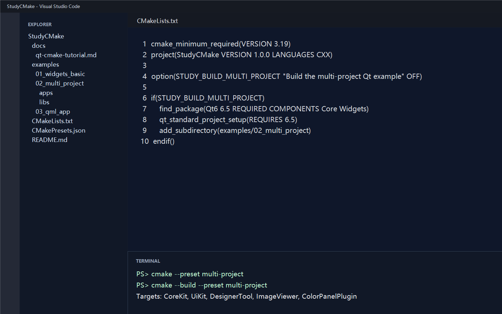
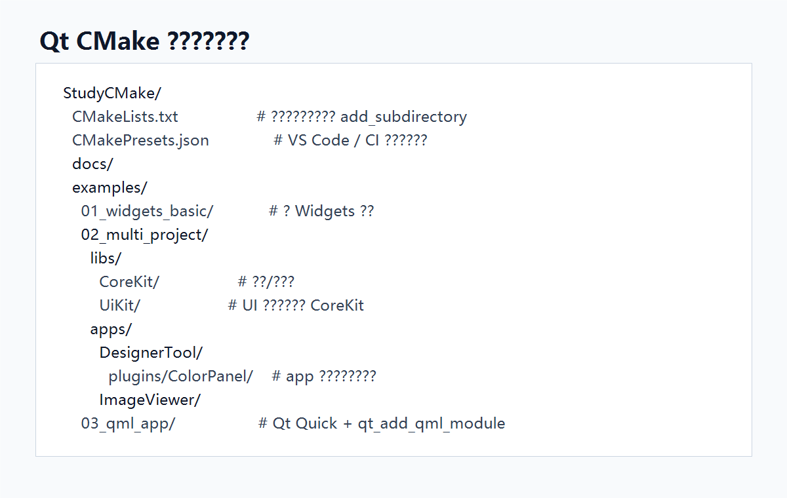
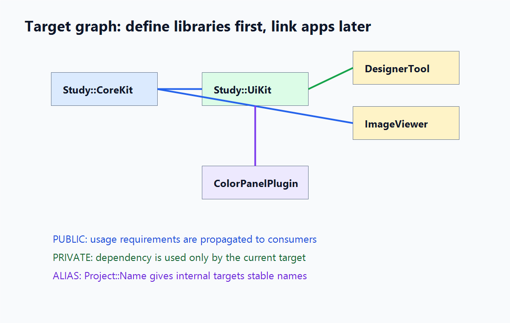
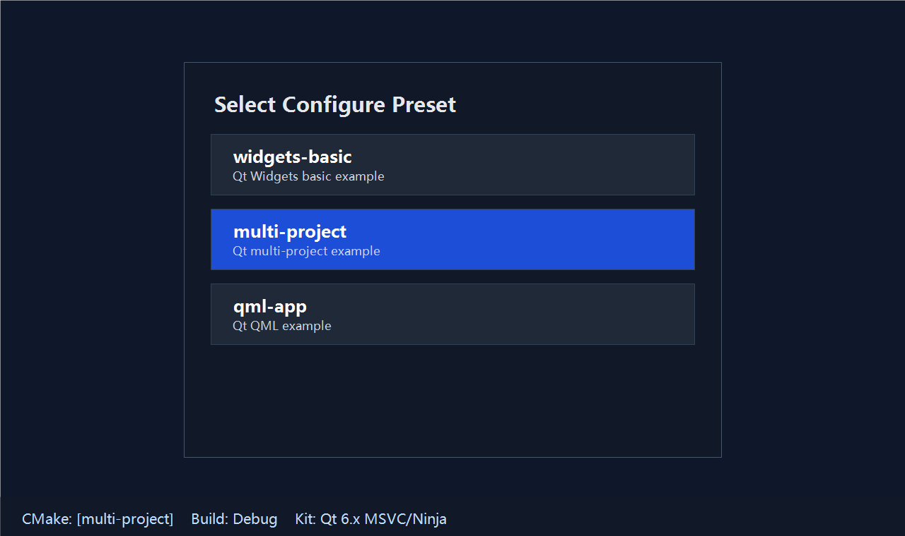

# Qt CMake 综合课程：从 0 基础到专业工程实践

本文是一套面向 Qt 6 开发的 CMake 系统课程。它不只告诉你“复制这段 CMakeLists”，而是从 0 基础开始解释每个命令、每个参数、每种目录组织方式背后的原因，最后落到能长期维护的大型 Qt 工程结构。

课程目标是让读者完成这条成长路径：

```text
能运行 Qt 工程
  -> 看懂 CMake 语法
  -> 会写标准单应用结构
  -> 会拆 app/lib/plugin/test
  -> 会管理依赖、资源、QML、安装部署
  -> 会使用行业公认的现代 CMake 工程化做法
```

“15 年经验”不是靠读一篇文档自动获得的，但这套课程会把很多资深工程师踩过的坑、形成的约定、以及大型项目里稳定有效的写法提前讲清楚。你照这个标准开项目，将来从单窗口工具扩展到多应用、多库、多插件的产品线，也不需要重写工程骨架。



## 0. 学习路线：从小白到能维护大型工程

建议按这个顺序学习，不要一开始就跳到多项目和部署：

```text
第 1 阶段：跑起来
  1. 看完整标准 Qt CMakeLists
  2. 学会 cmake -S . -B build
  3. 学会 cmake --build build

第 2 阶段：看懂
  4. 理解 CMake 命令、变量、列表、if、作用域
  5. 理解 target 是现代 CMake 的核心
  6. 理解 PUBLIC / PRIVATE / INTERFACE

第 3 阶段：写标准工程
  7. 单应用也拆成根 CMakeLists + apps/MyApp/CMakeLists
  8. app 只负责 executable，lib 只负责 library
  9. 所有依赖通过 target_link_libraries 表达

第 4 阶段：扩展工程
  10. 增加公共库
  11. 增加第二个应用
  12. 增加 app 内部嵌套子项目或插件
  13. 增加 QML、资源、翻译、测试

第 5 阶段：专业化
  14. 使用 CMakePresets
  15. 使用 install/deploy
  16. 接入第三方依赖和 CI
  17. 建立团队统一 CMake 规范
```

本文后面的章节就是按这条路径组织的。前半部分适合 0 基础读者，后半部分适合正在维护真实项目的开发者反复查阅。

## 1. 第一眼看懂标准 Qt CMakeLists

Qt Creator 创建 Widgets 工程时常见的标准写法大致如下：

```cmake
cmake_minimum_required(VERSION 3.19)
project(untitled30 LANGUAGES CXX)

find_package(Qt6 6.5 REQUIRED COMPONENTS Core Widgets)

qt_standard_project_setup()

qt_add_executable(untitled30
    WIN32 MACOSX_BUNDLE
    main.cpp
    mainwindow.cpp
    mainwindow.h
    mainwindow.ui
)

target_link_libraries(untitled30
    PRIVATE
        Qt::Core
        Qt::Widgets
)
```

这份文件已经体现了现代 Qt CMake 的几个关键点：

- `find_package(Qt6 ... COMPONENTS ...)`：声明需要哪些 Qt 模块。
- `qt_standard_project_setup()`：启用 Qt 常用默认行为，例如 AUTOMOC、AUTOUIC、安装目录变量等。
- `qt_add_executable()`：创建 Qt 应用目标，并处理 Qt target finalization。
- `target_link_libraries()`：把依赖绑定到 target，而不是全局设置 include/link path。
- `install()` 与 `qt_generate_deploy_app_script()`：把安装和部署纳入 CMake。

推荐你把“工程等于 targets 的集合”作为主线理解 CMake。目录只是组织方式，真正决定编译、链接、安装、IDE 展示的是 target。

## 2. CMake 语法逐项解释

这一章先不谈“大工程怎么组织”，只解释 CMake 语言本身。CMakeLists 看起来像脚本，但现代 CMake 的核心不是“执行一堆命令”，而是“声明一个个 target，并把属性挂到 target 上”。

### 2.1 CMakeLists.txt 是什么

`CMakeLists.txt` 是 CMake 默认读取的工程描述文件。文件名必须这样写：

```text
CMakeLists.txt
```

逐项解释：

- `CMake`：工具名，表示这个文件给 CMake 读取。
- `Lists`：历史命名，表示里面是一组命令列表。
- `.txt`：普通文本文件，不是二进制工程文件。

CMake 配置工程时从 `-S` 指定的源码目录开始找根 `CMakeLists.txt`：

```powershell
cmake -S . -B build
```

这里：

- `cmake`：运行 CMake 程序。
- `-S .`：source dir，源码目录是当前目录。
- `-B build`：binary dir，构建目录是 `build`。

CMake 会读取当前目录的 `CMakeLists.txt`，执行里面的命令，生成 Visual Studio、Ninja、Makefile 等后端工程文件。

### 2.2 CMake 命令的基本格式

CMake 命令统一长这样：

```cmake
command_name(argument1 argument2 argument3)
```

逐项解释：

- `command_name`：命令名，例如 `project`、`add_subdirectory`、`target_link_libraries`。
- `(`：参数列表开始。
- `argument1 argument2`：参数，参数之间用空白分隔，可以换行。
- `)`：参数列表结束。

下面两种写法等价：

```cmake
project(MyApp LANGUAGES CXX)
```

```cmake
project(
    MyApp
    LANGUAGES CXX
)
```

教程推荐多行写法，因为参数多的时候更清楚，也更方便 Git diff。

CMake 命令名大小写不敏感，下面也能运行：

```cmake
PROJECT(MyApp LANGUAGES CXX)
```

但现代项目统一使用小写命令名：

```cmake
project(MyApp LANGUAGES CXX)
```

参数大小写通常敏感。`CXX`、`PRIVATE`、`PUBLIC`、`REQUIRED` 这类关键字应按文档写。

### 2.3 注释、空白和换行

单行注释用 `#`：

```cmake
# This is a comment.
add_subdirectory(apps/MyApp)
```

`#` 后面的内容不会被 CMake 当成命令执行。

空行没有语义，只用于分组：

```cmake
find_package(Qt6 6.5 REQUIRED COMPONENTS Core Widgets)

qt_standard_project_setup(REQUIRES 6.5 SUPPORTS_UP_TO 6.11)

add_subdirectory(apps/MyApp)
```

推荐用空行隔开“找依赖”“项目 setup”“添加子目录”等逻辑块。

### 2.4 字符串、普通参数和引号

CMake 参数可以不加引号：

```cmake
project(MyQtProject)
```

这里 `MyQtProject` 是一个普通参数。

带空格的字符串必须加引号：

```cmake
project(MyQtProject DESCRIPTION "My Qt application")
```

如果不加引号：

```cmake
project(MyQtProject DESCRIPTION My Qt application)
```

CMake 会把它拆成三个参数：`My`、`Qt`、`application`，含义就变了。

建议规则：

- target 名、变量名、模块名：不加引号。
- 描述文字、路径中可能有空格的值：加引号。
- `if()` 里的普通变量判断：现代 CMake 通常不强制加引号，但路径和字符串比较时建议加。

### 2.5 变量和变量展开

定义变量：

```cmake
set(MY_APP_NAME MyApp)
```

使用变量：

```cmake
qt_add_executable(${MY_APP_NAME}
    main.cpp
)
```

逐项解释：

- `set`：设置变量。
- `MY_APP_NAME`：变量名。
- `MyApp`：变量值。
- `${MY_APP_NAME}`：变量展开，把变量值替换到当前位置。

变量名建议使用大写加下划线：

```cmake
set(PROJECT_NAMESPACE Study)
```

不要滥用变量。现代 CMake 更推荐把信息挂到 target 上，而不是用一堆全局变量传来传去。

### 2.6 列表

CMake 的列表本质上是用分号分隔的字符串。下面写法很常见：

```cmake
set(APP_SOURCES
    main.cpp
    mainwindow.cpp
    mainwindow.h
    mainwindow.ui
)
```

然后使用：

```cmake
qt_add_executable(MyApp
    ${APP_SOURCES}
)
```

小项目可以直接把源文件写在 target 里；源文件很多时，用变量分组也可以。但要注意：最终还是要传给 target。

更现代的方式是直接使用 `target_sources()`：

```cmake
target_sources(MyApp
    PRIVATE
        main.cpp
        mainwindow.cpp
)
```

### 2.7 if 条件

基本格式：

```cmake
if(CONDITION)
    message(STATUS "Condition is true")
endif()
```

常见用法：

```cmake
option(BUILD_TOOLS "Build developer tools" OFF)

if(BUILD_TOOLS)
    add_subdirectory(tools)
endif()
```

逐项解释：

- `option`：定义一个可由用户开关的缓存变量。
- `BUILD_TOOLS`：变量名。
- `"Build developer tools"`：给 CMake GUI、ccmake、IDE 看的说明。
- `OFF`：默认关闭。
- `if(BUILD_TOOLS)`：如果变量为真，就执行内部命令。
- `endif()`：结束条件块。

命令行启用：

```powershell
cmake -S . -B build -DBUILD_TOOLS=ON
```

这里 `-D` 表示定义 CMake cache 变量。

### 2.8 作用域：目录、函数、target

CMake 有目录作用域。每个 `add_subdirectory()` 会进入一个新的目录作用域：

```cmake
add_subdirectory(apps/MyApp)
```

进入 `apps/MyApp/CMakeLists.txt` 后：

- 子目录可以读到父目录中很多普通变量。
- 子目录里新设置的普通变量默认不会自动改回父目录。
- target 是全局可见的，只要已经被创建，后续目录可以链接它。

这就是为什么标准版推荐：

```cmake
add_subdirectory(libs/CoreKit)
add_subdirectory(apps/MyApp)
```

先创建库 target，再创建 app target，app 就能链接库：

```cmake
target_link_libraries(MyApp
    PRIVATE
        Project::CoreKit
)
```

现代 CMake 最重要的作用域是 target 作用域。你应该把 include 目录、编译定义、链接库、源文件都绑定到某个 target，而不是写成全局设置。

### 2.9 PUBLIC、PRIVATE、INTERFACE

这是 CMake 教程里最重要的一组词。

```cmake
target_link_libraries(UiKit
    PUBLIC
        Qt::Widgets
    PRIVATE
        Project::InternalHelper
)
```

逐项解释：

- `target_link_libraries`：给某个 target 添加链接依赖。
- `UiKit`：被设置的 target。
- `PUBLIC`：当前 target 需要，链接当前 target 的消费者也需要。
- `PRIVATE`：只有当前 target 自己需要，消费者不需要知道。
- `INTERFACE`：当前 target 自己不需要编译使用，只传递给消费者。

判断方法：

- 公开头文件里出现了某个依赖的类型：一般用 `PUBLIC`。
- 只有 `.cpp` 里用到了某个依赖：一般用 `PRIVATE`。
- 纯头文件库、配置包、编译选项集合：常用 `INTERFACE`。

例子：

```cpp
// include/UiKit/bannerwidget.h
#include <QWidget>
```

因为公开头文件包含了 `QWidget`，所以 `UiKit` 对 `Qt::Widgets` 的依赖应该是 `PUBLIC`：

```cmake
target_link_libraries(UiKit
    PUBLIC
        Qt::Widgets
)
```

这样 app 只要链接 `UiKit`，也会自动获得 Qt Widgets 的 include、编译定义和链接信息。

### 2.10 逐句拆解标准 Qt Widgets CMakeLists

下面是一份最小 Qt Widgets app 的 CMake：

```cmake
cmake_minimum_required(VERSION 3.19)
```

逐项解释：

- `cmake_minimum_required`：声明本工程要求的最低 CMake 版本。
- `VERSION`：关键字，后面跟版本号。
- `3.19`：最低版本。低于这个版本的 CMake 会直接报错。

为什么要写在第一行：它还会设置 CMake policy 的默认行为，影响后续命令解释方式。

```cmake
project(MyQtProject
    VERSION 1.0.0
    DESCRIPTION "My Qt application"
    LANGUAGES CXX
)
```

逐项解释：

- `project`：声明项目。
- `MyQtProject`：项目名，会影响 `${PROJECT_NAME}`。
- `VERSION 1.0.0`：项目版本，会设置 `${PROJECT_VERSION}`。
- `DESCRIPTION "My Qt application"`：项目描述。
- `LANGUAGES CXX`：项目使用 C++。`CXX` 是 CMake 对 C++ 语言的名字，不写成 `CPP`。

```cmake
set(CMAKE_CXX_STANDARD 17)
set(CMAKE_CXX_STANDARD_REQUIRED ON)
set(CMAKE_CXX_EXTENSIONS OFF)
```

逐项解释：

- `CMAKE_CXX_STANDARD`：默认 C++ 标准。
- `17`：使用 C++17。
- `CMAKE_CXX_STANDARD_REQUIRED`：是否强制要求这个标准。
- `ON`：打开。
- `CMAKE_CXX_EXTENSIONS`：是否允许编译器扩展，例如 GNU 扩展。
- `OFF`：关闭扩展，尽量使用标准 C++。

```cmake
find_package(Qt6 6.5 REQUIRED COMPONENTS Core Widgets)
```

逐项解释：

- `find_package`：查找外部包。
- `Qt6`：包名。
- `6.5`：最低 Qt 版本。
- `REQUIRED`：找不到就配置失败。
- `COMPONENTS`：只查找后面列出的 Qt 模块。
- `Core`：Qt Core 模块。
- `Widgets`：Qt Widgets 模块。

成功后，Qt 会提供 imported targets：

```cmake
Qt::Core
Qt::Widgets
```

它们不是字符串装饰，而是真正的 CMake target，里面带有 include 路径、库路径、编译定义等信息。

```cmake
qt_standard_project_setup(REQUIRES 6.5 SUPPORTS_UP_TO 6.11)
```

逐项解释：

- `qt_standard_project_setup`：Qt 提供的 CMake helper。
- `REQUIRES 6.5`：声明项目使用 Qt 6.5 起支持的行为。
- `SUPPORTS_UP_TO 6.11`：声明项目已经确认支持到 Qt 6.11 的相关 Qt CMake policy。

它通常会启用或设置：

- `CMAKE_AUTOMOC`：自动处理带 `Q_OBJECT` 的头文件。
- `CMAKE_AUTOUIC`：自动处理 `.ui` 文件。
- `CMAKE_AUTORCC`：自动处理 `.qrc` 文件。
- GNUInstallDirs：提供 `${CMAKE_INSTALL_BINDIR}`、`${CMAKE_INSTALL_LIBDIR}` 等安装目录变量。

```cmake
add_subdirectory(apps/MyApp)
```

逐项解释：

- `add_subdirectory`：让 CMake 进入子目录继续读取 `CMakeLists.txt`。
- `apps/MyApp`：相对当前 `CMakeLists.txt` 的子目录路径。

子目录里通常创建真正的 app target。

```cmake
qt_add_executable(MyApp
    WIN32 MACOSX_BUNDLE
    main.cpp
    mainwindow.cpp
    mainwindow.h
    mainwindow.ui
)
```

逐项解释：

- `qt_add_executable`：Qt 对 CMake `add_executable` 的封装。
- `MyApp`：target 名，也是默认输出程序名。
- `WIN32`：Windows 下生成 GUI 程序入口，不弹控制台窗口。
- `MACOSX_BUNDLE`：macOS 下生成 `.app` bundle。
- `main.cpp`、`mainwindow.cpp`：C++ 源文件。
- `mainwindow.h`：头文件，放进 target 后 AUTOMOC 能可靠发现 `Q_OBJECT`。
- `mainwindow.ui`：Qt Designer UI 文件，AUTOUIC 会生成 `ui_mainwindow.h`。

```cmake
target_link_libraries(MyApp
    PRIVATE
        Qt::Core
        Qt::Widgets
)
```

逐项解释：

- `target_link_libraries`：给 target 链接依赖。
- `MyApp`：要设置的 target。
- `PRIVATE`：这些依赖只属于 `MyApp` 自己，不向其他 target 传递。
- `Qt::Core`：Qt Core imported target。
- `Qt::Widgets`：Qt Widgets imported target。

对于可执行程序，大多数依赖都是 `PRIVATE`。库 target 才更需要认真区分 `PUBLIC` 和 `PRIVATE`。

```cmake
install(TARGETS MyApp
    BUNDLE  DESTINATION .
    RUNTIME DESTINATION ${CMAKE_INSTALL_BINDIR}
    LIBRARY DESTINATION ${CMAKE_INSTALL_LIBDIR}
)
```

逐项解释：

- `install`：声明安装规则。
- `TARGETS MyApp`：安装 `MyApp` 这个 target。
- `BUNDLE DESTINATION .`：macOS bundle 安装到安装前缀根目录。
- `RUNTIME DESTINATION ...`：Windows `.exe` 或 Linux 可执行文件安装目录。
- `LIBRARY DESTINATION ...`：动态库安装目录。
- `${CMAKE_INSTALL_BINDIR}`：通常是 `bin`。
- `${CMAKE_INSTALL_LIBDIR}`：通常是 `lib`。

```cmake
qt_generate_deploy_app_script(
    TARGET MyApp
    OUTPUT_SCRIPT deploy_script
    NO_UNSUPPORTED_PLATFORM_ERROR
)
install(SCRIPT ${deploy_script})
```

逐项解释：

- `qt_generate_deploy_app_script`：生成 Qt 应用部署脚本。
- `TARGET MyApp`：为哪个 app 生成部署脚本。
- `OUTPUT_SCRIPT deploy_script`：把生成脚本路径存入变量 `deploy_script`。
- `NO_UNSUPPORTED_PLATFORM_ERROR`：平台不支持自动部署时不直接报 fatal error。
- `install(SCRIPT ${deploy_script})`：安装阶段执行这个部署脚本。

Windows 上它会帮助复制 Qt DLL、platform plugin 等运行时依赖。

### 2.11 CMake 的配置阶段和构建阶段

CMake 通常分两步：

```powershell
cmake -S . -B build
cmake --build build
```

第一步是配置和生成：

- 读取 `CMakeLists.txt`。
- 查找 Qt、编译器和依赖。
- 生成后端工程文件。
- 不真正编译 `.cpp`。

第二步才是构建：

- 调用 MSBuild、Ninja 或 Make。
- 编译 `.cpp`。
- 运行 MOC/UIC/RCC。
- 链接 `.exe`、`.lib`、`.dll`。

所以，改了 `CMakeLists.txt` 后需要重新 configure；只改 `.cpp` 通常只需要 build。

### 2.12 现代 CMake 写法和旧写法对比

旧写法：

```cmake
include_directories(include)
link_directories(lib)
add_definitions(-DMY_DEFINE)
```

问题是这些命令影响范围大，容易污染后续 target。

现代写法：

```cmake
target_include_directories(MyLib
    PUBLIC
        ${CMAKE_CURRENT_SOURCE_DIR}/include
)

target_compile_definitions(MyLib
    PRIVATE
        MY_DEFINE
)

target_link_libraries(MyApp
    PRIVATE
        MyLib
)
```

现代写法的优势：

- 每个属性属于明确的 target。
- 依赖能自动传递。
- IDE、安装导出、包管理更容易理解。
- 大工程不容易互相污染。

这也是本教程反复强调 target 的原因。

## 3. 推荐目录结构

小工程可以平铺，但中大型 Qt 项目最好从一开始就分层：

```text
StudyCMake/
  CMakeLists.txt
  CMakePresets.json
  apps/
    DesignerTool/
    ImageViewer/
  libs/
    CoreKit/
    UiKit/
  plugins/
  qml/
  resources/
  tests/
  docs/
```

本仓库示例使用：

```text
examples/
  01_widgets_basic/
  02_multi_project/
    apps/
      DesignerTool/
        plugins/ColorPanel/
      ImageViewer/
    libs/
      CoreKit/
      UiKit/
  03_qml_app/
```



目录规划建议：

- `apps/` 放最终可执行程序，每个 app 自己有 `CMakeLists.txt`。
- `libs/` 放可复用 C++/Qt 库，不直接依赖具体 app。
- `plugins/` 放插件或插件式模块，能独立成 target。
- `resources/` 放 `.qrc`、图片、样式、翻译原始文件。
- `tests/` 放测试 target，避免混在 app 目录里。
- `docs/` 放教程、架构图、发布说明。

## 4. 根 CMakeLists 的职责

根 `CMakeLists.txt` 不应该塞满源文件。它的职责是设定项目、查找公共依赖、引入子目录：

```cmake
cmake_minimum_required(VERSION 3.19)

project(StudyCMake
    VERSION 1.0.0
    LANGUAGES CXX
)

find_package(Qt6 6.5 REQUIRED COMPONENTS Core Widgets)
qt_standard_project_setup(REQUIRES 6.5 SUPPORTS_UP_TO 6.11)

add_subdirectory(libs/CoreKit)
add_subdirectory(libs/UiKit)
add_subdirectory(apps/DesignerTool)
add_subdirectory(apps/ImageViewer)
```

本仓库根目录多了一层 `option()`，目的是让教程示例按需构建：

```cmake
option(STUDY_BUILD_WIDGETS_BASIC "Build the basic Qt Widgets example" OFF)

if(STUDY_BUILD_WIDGETS_BASIC)
    add_subdirectory(examples/01_widgets_basic)
endif()
```

真实产品仓库通常可以默认构建主 app，把 examples、tools、tests 设为可选。

## 5. 绝对标准版：单应用也拆分 CMakeLists

如果只记一套写法，建议记这一套：即使当前项目只有一个 Qt 应用，也保留根 `CMakeLists.txt`，把真正的应用 target 放到子目录。这样以后添加新应用、新库、新插件、新测试工程时，只需要增加目录和 `add_subdirectory()`，不会把根文件越改越乱。

标准目录：

```text
MyQtProject/
  CMakeLists.txt
  CMakePresets.json
  apps/
    MyApp/
      CMakeLists.txt
      main.cpp
      mainwindow.h
      mainwindow.cpp
      mainwindow.ui
  libs/
  plugins/
  tests/
  resources/
```

哪怕 `libs/`、`plugins/`、`tests/` 暂时为空，也可以先不创建目录；关键是根工程只做项目级配置，具体 target 永远下沉到子目录。

根 `CMakeLists.txt` 标准版：

```cmake
cmake_minimum_required(VERSION 3.19)

project(MyQtProject
    VERSION 1.0.0
    DESCRIPTION "My Qt application"
    LANGUAGES CXX
)

set(CMAKE_CXX_STANDARD 17)
set(CMAKE_CXX_STANDARD_REQUIRED ON)
set(CMAKE_CXX_EXTENSIONS OFF)

find_package(Qt6 6.5 REQUIRED COMPONENTS Core Widgets)
qt_standard_project_setup(REQUIRES 6.5 SUPPORTS_UP_TO 6.11)

add_subdirectory(apps/MyApp)
```

`apps/MyApp/CMakeLists.txt` 标准版：

```cmake
qt_add_executable(MyApp
    WIN32 MACOSX_BUNDLE
    main.cpp
    mainwindow.cpp
    mainwindow.h
    mainwindow.ui
)

target_link_libraries(MyApp
    PRIVATE
        Qt::Core
        Qt::Widgets
)

install(TARGETS MyApp
    BUNDLE  DESTINATION .
    RUNTIME DESTINATION ${CMAKE_INSTALL_BINDIR}
    LIBRARY DESTINATION ${CMAKE_INSTALL_LIBDIR}
)

qt_generate_deploy_app_script(
    TARGET MyApp
    OUTPUT_SCRIPT deploy_script
    NO_UNSUPPORTED_PLATFORM_ERROR
)
install(SCRIPT ${deploy_script})
```

这套写法的边界非常清楚：

- 根 `CMakeLists.txt`：项目名、版本、C++ 标准、公共 Qt setup、全局开关、引入子目录。
- app 子目录：只定义这个应用自己的源文件、依赖、安装和部署。
- lib 子目录：只定义库 target、公开头文件目录、库依赖和 alias。
- plugin/feature 子目录：只定义插件式模块或功能模块。
- tests 子目录：只定义测试 target，不污染应用 target。

将来从单应用扩展成多应用时，只需要这样改根文件：

```cmake
add_subdirectory(apps/MyApp)
add_subdirectory(apps/AdminTool)
add_subdirectory(libs/CoreKit)
```

然后让应用按需链接库：

```cmake
target_link_libraries(MyApp
    PRIVATE
        Qt::Widgets
        Project::CoreKit
)
```

也就是说，标准版不是为了当前多写几行，而是为了保证项目从第一天起就能自然长大。

执行时建议遵守这几条硬规则：

- 根目录必须长期保留 `CMakeLists.txt`，不要让唯一 app 的 `CMakeLists.txt` 变成事实根工程。
- 根目录不直接写 `main.cpp`、`mainwindow.cpp` 这类业务源文件。
- 每个可执行程序一个目录、一个 target、一个 `CMakeLists.txt`。
- 每个可复用库一个目录、一个 target、一个 `CMakeLists.txt`，并提供 `Project::Name` alias。
- app 只能链接库 target，不直接偷 include 其他模块的 `src/` 目录。
- 目录之间少传普通变量，依赖关系通过 `target_link_libraries()`、`target_include_directories()` 的 `PUBLIC/PRIVATE/INTERFACE` 表达。
- 新增功能时先判断它是 app 内部源码、可复用库、插件式模块还是测试，再决定用 `target_sources()`、`qt_add_library()` 或 `qt_add_executable()`。

这就是本文推荐的“绝对标准版”判断标准：根管工程，子目录管 target，target 管依赖。

## 6. 单 Widgets 应用

见 [examples/01_widgets_basic/CMakeLists.txt](../examples/01_widgets_basic/CMakeLists.txt)。

```cmake
find_package(Qt6 6.5 REQUIRED COMPONENTS Core Widgets)

qt_add_executable(WidgetsBasic
    WIN32 MACOSX_BUNDLE
    main.cpp
    mainwindow.cpp
    mainwindow.h
    mainwindow.ui
)

target_link_libraries(WidgetsBasic
    PRIVATE
        Qt::Core
        Qt::Widgets
)
```

`mainwindow.ui` 能自动生成 `ui_mainwindow.h`，原因是 `qt_standard_project_setup()` 启用了 `CMAKE_AUTOUIC`。如果你的 target 在调用 `qt_standard_project_setup()` 之前创建，自动处理可能不会作用到它。

常见文件对应关系：

- `.h` 中有 `Q_OBJECT`：需要 MOC。
- `.ui`：需要 UIC 生成界面头文件。
- `.qrc`：需要 RCC 打包资源。
- `.cpp`：正常 C++ 编译单元。

这个示例保留了 Qt Creator 生成工程的紧凑写法，方便和最初的标准模板对应。正式产品更推荐上一节的“根工程 + app 子目录”标准版。

## 7. 多项目：多个 app + 多个 lib

多项目工程的核心是“库先定义，应用后链接”：

```text
libs/CoreKit  -> Study::CoreKit
libs/UiKit    -> Study::UiKit, links Study::CoreKit
apps/DesignerTool -> links Study::UiKit
apps/ImageViewer  -> links Study::CoreKit
```



库 target 示例：

```cmake
qt_add_library(CoreKit STATIC
    include/CoreKit/projectinfo.h
    src/projectinfo.cpp
)

target_include_directories(CoreKit
    PUBLIC
        ${CMAKE_CURRENT_SOURCE_DIR}/include
)

target_link_libraries(CoreKit
    PUBLIC
        Qt::Core
)

add_library(Study::CoreKit ALIAS CoreKit)
```

这里 `PUBLIC` 和 `PRIVATE` 很重要：

- `PRIVATE`：只有当前 target 自己需要。
- `PUBLIC`：当前 target 需要，链接它的人也需要。
- `INTERFACE`：当前 target 自己不编译使用，只传递给消费者。

如果 `CoreKit` 的公开头文件包含了 `QString`，那么 `Qt::Core` 应该是 `PUBLIC`，这样 app 链接 `Study::CoreKit` 后能自动拿到 Qt Core 的 include 和 link 信息。

应用 target 示例：

```cmake
qt_add_executable(DesignerTool
    WIN32 MACOSX_BUNDLE
    main.cpp
)

target_link_libraries(DesignerTool
    PRIVATE
        Qt::Widgets
        Study::UiKit
)
```

建议为内部库增加命名空间别名，例如 `Study::CoreKit`。这样 CMake 报错会更明确，也能和外部包风格保持一致。

## 8. 多项目下面再嵌子项目

有些 app 内部还会有插件、工具面板、协议模块、编辑器扩展等。可以继续嵌套：

```text
apps/DesignerTool/
  CMakeLists.txt
  main.cpp
  plugins/
    ColorPanel/
      CMakeLists.txt
      colorpanel.h
      colorpanel.cpp
```

父级 app：

```cmake
add_subdirectory(plugins/ColorPanel)
```

子项目：

```cmake
qt_add_library(ColorPanelPlugin STATIC
    colorpanel.cpp
    colorpanel.h
)

target_link_libraries(ColorPanelPlugin
    PUBLIC
        Qt::Widgets
)

add_library(Study::ColorPanelPlugin ALIAS ColorPanelPlugin)
```

嵌套子项目适合这几类情况：

- 只服务于某个 app 的复杂模块。
- 将来可能拆成动态插件。
- 模块需要自己的资源、UI、测试或第三方依赖。
- 团队中由不同人维护，目录边界能降低冲突。

如果只是两个 `.cpp`，不要过度拆 target。先用 `target_sources()` 加到 app 里即可。

## 9. 什么时候用 target_sources

当 target 已经在父目录创建，但源文件分散在子目录时，可以用 `target_sources()`：

```cmake
target_sources(DesignerTool
    PRIVATE
        panels/objectinspector.cpp
        panels/objectinspector.h
)
```

适用场景：

- 子目录只是源码分类，不需要独立链接。
- 不希望 IDE 里出现过多 target。
- 模块没有独立复用价值。

不适合：

- 子模块要被多个 app 复用。
- 子模块有独立依赖或测试。
- 子模块需要安装、导出或插件化。

## 10. QML/Qt Quick 工程

见 [examples/03_qml_app/CMakeLists.txt](../examples/03_qml_app/CMakeLists.txt)。

```cmake
find_package(Qt6 6.5 REQUIRED COMPONENTS Core Gui Qml Quick)

qt_add_executable(QmlDashboard
    main.cpp
)

qt_add_qml_module(QmlDashboard
    URI Study.Dashboard
    VERSION 1.0
    QML_FILES
        Main.qml
        components/MetricCard.qml
)
```

`qt_add_qml_module()` 是 Qt 6 推荐的 QML 模块定义方式。它会处理 QML 文件、资源、类型注册、qmldir 以及相关工具 target。

QML 模块命名建议：

- URI 使用反向域名或产品命名空间，例如 `Company.Product.Controls`。
- 文件目录尽量和模块边界一致。
- 公共 QML 控件独立成模块，app 只 import。
- C++ 类型注册和 QML 文件放在同一个 backing target 时最简单。

部署 QML 应用时使用：

```cmake
qt_generate_deploy_qml_app_script(
    TARGET QmlDashboard
    OUTPUT_SCRIPT deploy_script
    NO_UNSUPPORTED_PLATFORM_ERROR
)
install(SCRIPT ${deploy_script})
```

## 11. 资源、图标、翻译

Qt 6 可以直接在 target 中加入 `.qrc`：

```cmake
qt_add_executable(MyApp
    main.cpp
    assets.qrc
)
```

也可以用更显式的资源 API：

```cmake
qt_add_resources(MyApp "app_assets"
    PREFIX "/"
    FILES
        images/logo.png
        styles/app.qss
)
```

翻译建议放在根 setup 或专门模块中统一管理：

```cmake
qt_standard_project_setup(
    REQUIRES 6.5
    I18N_SOURCE_LANGUAGE en
    I18N_TRANSLATED_LANGUAGES zh_CN ja_JP
)
```

如果是多个 app，共享翻译和每个 app 的翻译要分开命名，避免生成文件互相覆盖。

## 12. 安装与部署

Qt 应用不能只复制 `.exe`。Windows 还需要 Qt DLL、platform plugins、imageformats、styles、QML imports 等。标准 Widgets 应用可用：

```cmake
install(TARGETS MyApp
    BUNDLE  DESTINATION .
    RUNTIME DESTINATION ${CMAKE_INSTALL_BINDIR}
    LIBRARY DESTINATION ${CMAKE_INSTALL_LIBDIR}
)

qt_generate_deploy_app_script(
    TARGET MyApp
    OUTPUT_SCRIPT deploy_script
    NO_UNSUPPORTED_PLATFORM_ERROR
)
install(SCRIPT ${deploy_script})
```

命令行：

```powershell
cmake --install build --prefix package
```

多 app 时可以为每个 app 生成部署脚本，或在顶层集中处理。简单项目按 app 各自写，复杂产品再抽函数。

## 13. VS Code 配置

推荐安装：

- CMake Tools
- C/C++
- Qt tools 扩展按需安装

使用 `CMakePresets.json` 后，VS Code 可以直接选择 preset：

```json
{
  "version": 6,
  "configurePresets": [
    {
      "name": "multi-project",
      "generator": "Ninja",
      "binaryDir": "${sourceDir}/out/build/multi-project",
      "cacheVariables": {
        "CMAKE_BUILD_TYPE": "Debug",
        "STUDY_BUILD_MULTI_PROJECT": "ON"
      }
    }
  ]
}
```



如果 CMake 找不到 Qt，常见解决方式：

```powershell
cmake -S . -B build -DCMAKE_PREFIX_PATH=C:/Qt/6.7.3/msvc2019_64
```

或写入 `CMakeUserPresets.json`，这个文件不提交到 Git：

```json
{
  "version": 6,
  "configurePresets": [
    {
      "name": "my-qt",
      "inherits": "multi-project",
      "cacheVariables": {
        "CMAKE_PREFIX_PATH": "C:/Qt/6.7.3/msvc2019_64"
      }
    }
  ]
}
```

## 14. Qt Creator 配置

Qt Creator 对 Qt CMake 支持很完整。建议：

- 一个 Kit 对应一个 Qt 版本、编译器和架构。
- 使用 shadow build，不要把构建产物放进源码目录。
- Debug/Release 分开构建目录。
- 多 app 工程用 target selector 选择启动目标。
- 改了 `find_package()`、target 名、Qt 模块后重新运行 CMake 配置。

Qt Creator 生成的 `CMakeLists.txt.user` 是本机配置，不应提交。

## 15. 常见工程模式

### 单 app

```text
src/
  main.cpp
  mainwindow.*
  CMakeLists.txt
```

适合工具、小 demo、一次性应用。

### app + 公共库

```text
libs/Core/
apps/MainApp/
```

适合业务开始增长，但最终只有一个应用。

### 多 app + 多库

```text
apps/Admin/
apps/Client/
apps/Launcher/
libs/Domain/
libs/Ui/
libs/Network/
```

适合同一产品线多个入口，共用底层能力。

### app 下嵌 feature/plugin

```text
apps/Editor/plugins/Timeline/
apps/Editor/plugins/Inspector/
```

适合编辑器、IDE、设计器、工业软件、内部平台。

### 超级工程

```text
third_party/
tools/
examples/
tests/
```

适合 SDK、框架、组件库。注意默认构建项要克制，避免读者或 CI 被大量示例拖慢。

## 16. 常见坑位

- `Q_OBJECT` 相关链接错误：确认启用了 AUTOMOC，头文件在 target 源文件列表中。
- `.ui` 找不到 `ui_xxx.h`：确认启用了 AUTOUIC，`.ui` 在 target 源文件列表中。
- `Qt6Config.cmake` 找不到：设置 `CMAKE_PREFIX_PATH` 或使用 Qt Creator Kit。
- `target_link_libraries` 用了裸库路径：优先使用 `Qt::Widgets`、`Study::CoreKit` 这种 imported/alias target。
- include 目录全局污染：少用 `include_directories()`，改用 `target_include_directories()`。
- 多 app 安装互相覆盖：给资源、插件、配置文件安排清晰的安装目标目录。
- Debug/Release 混用：Windows 上尤其要避免不同配置 DLL 和 exe 混在一起。
- QML import 运行时失败：使用 `qt_add_qml_module()`，部署时使用 QML 部署脚本。
- 子目录变量互相影响：少依赖普通变量跨目录传递，优先让 target 传递属性。

## 17. 实战技巧与标杆做法

这一章是扩展内容，来自现代 CMake、Qt 官方 CMake 推荐方式、以及大型 C++/Qt 项目长期维护中反复验证过的做法。初学者第一次读可以先记结论，等项目变大后再回来细看。

### 17.1 永远区分源码目录和构建目录

标杆做法：源码目录只放源码，构建目录只放生成物。

推荐：

```powershell
cmake -S . -B out/build/debug
cmake --build out/build/debug
```

不推荐：

```powershell
cmake .
```

原因：

- 构建产物不会污染源码目录。
- Debug、Release、不同 Qt Kit 可以并存。
- 删除构建目录即可重新配置，不会误删源码。
- CI 和本地开发命令一致。

建议 `.gitignore` 至少包含：

```gitignore
out/
build*/
CMakeUserPresets.json
*.user
```

### 17.2 用 CMakePresets 固化团队入口

标杆做法：提交 `CMakePresets.json`，不提交 `CMakeUserPresets.json`。

`CMakePresets.json` 放团队共享配置：

```json
{
  "version": 6,
  "configurePresets": [
    {
      "name": "dev-debug",
      "generator": "Ninja",
      "binaryDir": "${sourceDir}/out/build/dev-debug",
      "cacheVariables": {
        "CMAKE_BUILD_TYPE": "Debug"
      }
    }
  ]
}
```

本机 Qt 路径、个人编译器路径放 `CMakeUserPresets.json`：

```json
{
  "version": 6,
  "configurePresets": [
    {
      "name": "my-qt-debug",
      "inherits": "dev-debug",
      "cacheVariables": {
        "CMAKE_PREFIX_PATH": "C:/Qt/6.7.3/msvc2019_64"
      }
    }
  ]
}
```

这样团队成员使用同一套 preset 名称，但每个人可以有自己的 Qt 安装路径。

### 17.3 target 命名要稳定

标杆做法：

```cmake
qt_add_library(CoreKit STATIC ...)
add_library(Project::CoreKit ALIAS CoreKit)
```

应用链接 alias：

```cmake
target_link_libraries(MyApp
    PRIVATE
        Project::CoreKit
)
```

好处：

- `Project::CoreKit` 一看就是 CMake target，不会被误认为系统库名。
- 将来 `CoreKit` 从静态库变动态库，消费者不用改。
- 将来库迁到外部包，也能保持相似的链接写法。
- CMake 报错更清晰。

不要随意重命名 target。target 名是工程 API，改名会影响 IDE、脚本、安装导出、CI 和其他子项目。

### 17.4 不要全局污染 include、link、define

旧写法：

```cmake
include_directories(include)
add_definitions(-DUNICODE)
link_directories(lib)
```

标杆写法：

```cmake
target_include_directories(CoreKit
    PUBLIC
        ${CMAKE_CURRENT_SOURCE_DIR}/include
)

target_compile_definitions(CoreKit
    PRIVATE
        COREKIT_BUILDING
)

target_link_libraries(MyApp
    PRIVATE
        Project::CoreKit
)
```

全局命令的最大问题是影响范围太大。项目小的时候看不出，项目一大就会出现“某个子目录莫名其妙拿到了不该有的 include 路径或宏定义”的问题。

### 17.5 源文件显式列出，少用 file(GLOB)

很多初学者喜欢：

```cmake
file(GLOB APP_SOURCES *.cpp *.h)
```

更推荐：

```cmake
qt_add_executable(MyApp
    main.cpp
    mainwindow.cpp
    mainwindow.h
    mainwindow.ui
)
```

原因：

- 新增或删除源文件时，Git diff 能明确看到 CMakeLists 的变化。
- IDE 展示更稳定。
- 某些生成器对文件新增的自动重新配置并不总是符合预期。

如果确实是资源目录、插件扫描、示例批量收集，可以使用：

```cmake
file(GLOB CONFIGURE_DEPENDS QML_FILES qml/*.qml)
```

但核心源码仍建议显式列出。

### 17.6 用 target_compile_features 表达语言标准

根工程里写：

```cmake
set(CMAKE_CXX_STANDARD 17)
set(CMAKE_CXX_STANDARD_REQUIRED ON)
set(CMAKE_CXX_EXTENSIONS OFF)
```

适合统一项目默认标准。

库对外暴露 C++ 标准要求时，可以更精确：

```cmake
target_compile_features(CoreKit
    PUBLIC
        cxx_std_17
)
```

如果公开头文件使用了 C++17 特性，应该是 `PUBLIC`；如果只有 `.cpp` 内部使用，通常是 `PRIVATE`。

### 17.7 区分 Project、Target、Module、Package

这四个词经常被混用，但最好分清：

- Project：一次 CMake 配置的顶层工程，例如 `StudyCMake`。
- Target：CMake 里可构建或可链接的对象，例如 `MyApp`、`CoreKit`。
- Module：Qt 模块或 CMake 模块，例如 `Qt::Widgets`、`FindXxx.cmake`。
- Package：`find_package()` 能找到的包，例如 `Qt6`、`OpenSSL`、`fmt`。

很多 CMake 混乱来自把 project 当 target，或者把 package 名当库名。记住：真正链接时应该链接 target。

### 17.8 第三方依赖优先使用 imported target

推荐：

```cmake
find_package(OpenSSL REQUIRED)

target_link_libraries(NetworkKit
    PRIVATE
        OpenSSL::SSL
        OpenSSL::Crypto
)
```

不推荐：

```cmake
target_include_directories(NetworkKit PRIVATE C:/OpenSSL/include)
target_link_libraries(NetworkKit PRIVATE C:/OpenSSL/lib/libssl.lib)
```

如果使用 vcpkg、Conan、系统包或 Qt 自带包，只要它们提供 imported target，就优先链接 imported target。这样 include 路径、库路径、编译定义、平台差异都由包自己处理。

### 17.9 add_subdirectory、FetchContent、find_package 怎么选

常见选择：

```text
项目内部模块        -> add_subdirectory()
第三方源码随项目构建 -> FetchContent 或 git submodule + add_subdirectory()
系统/包管理器依赖    -> find_package()
```

内部库：

```cmake
add_subdirectory(libs/CoreKit)
```

外部已安装包：

```cmake
find_package(Qt6 REQUIRED COMPONENTS Widgets)
```

FetchContent 示例：

```cmake
include(FetchContent)

FetchContent_Declare(
    fmt
    GIT_REPOSITORY https://github.com/fmtlib/fmt.git
    GIT_TAG 10.2.1
)

FetchContent_MakeAvailable(fmt)

target_link_libraries(MyApp
    PRIVATE
        fmt::fmt
)
```

建议：团队产品优先用包管理器或锁定版本的依赖方式，不要让每次 configure 都下载不确定版本。

### 17.10 使用 interface target 统一项目警告和选项

大型项目常用一个 `INTERFACE` target 承载通用编译选项：

```cmake
add_library(ProjectWarnings INTERFACE)

target_compile_options(ProjectWarnings
    INTERFACE
        $<$<CXX_COMPILER_ID:MSVC>:/W4>
        $<$<NOT:$<CXX_COMPILER_ID:MSVC>>:-Wall -Wextra -Wpedantic>
)
```

使用：

```cmake
target_link_libraries(CoreKit
    PRIVATE
        ProjectWarnings
)
```

这里出现了 generator expression：

```cmake
$<$<CXX_COMPILER_ID:MSVC>:/W4>
```

意思是：如果当前 C++ 编译器是 MSVC，就添加 `/W4`。它比手写很多 `if(MSVC)` 更适合挂在 target 属性里。

初学者可以先不写 generator expression，但要知道大型跨平台项目经常用它处理编译器、平台、Debug/Release 差异。

### 17.11 用函数消除重复，但不要过早封装

多 app 都需要安装和部署时，可以封装函数：

```cmake
function(project_install_qt_app target_name)
    install(TARGETS ${target_name}
        BUNDLE  DESTINATION .
        RUNTIME DESTINATION ${CMAKE_INSTALL_BINDIR}
        LIBRARY DESTINATION ${CMAKE_INSTALL_LIBDIR}
    )

    qt_generate_deploy_app_script(
        TARGET ${target_name}
        OUTPUT_SCRIPT deploy_script
        NO_UNSUPPORTED_PLATFORM_ERROR
    )
    install(SCRIPT ${deploy_script})
endfunction()
```

使用：

```cmake
project_install_qt_app(MyApp)
```

但不要一开始就把所有东西都封装成函数。CMake 的可读性很重要。重复两次可以接受，重复三到五次且规则稳定时再抽函数。

### 17.12 输出目录要谨慎设置

有些项目会统一 exe/lib 输出目录：

```cmake
set(CMAKE_RUNTIME_OUTPUT_DIRECTORY ${CMAKE_BINARY_DIR}/bin)
set(CMAKE_LIBRARY_OUTPUT_DIRECTORY ${CMAKE_BINARY_DIR}/lib)
set(CMAKE_ARCHIVE_OUTPUT_DIRECTORY ${CMAKE_BINARY_DIR}/lib)
```

这能让运行路径更集中，但也可能带来 Debug/Release 混放问题。Visual Studio 这种多配置生成器尤其要注意配置名：

```cmake
set(CMAKE_RUNTIME_OUTPUT_DIRECTORY_DEBUG ${CMAKE_BINARY_DIR}/bin/Debug)
set(CMAKE_RUNTIME_OUTPUT_DIRECTORY_RELEASE ${CMAKE_BINARY_DIR}/bin/Release)
```

建议初学者先使用 CMake 默认输出目录。等部署、运行调试有明确需求后再统一设置。

### 17.13 Qt 项目不要手动调用 moc/uic/rcc

现代 Qt CMake 推荐让 CMake 自动处理：

```cmake
qt_standard_project_setup(REQUIRES 6.5 SUPPORTS_UP_TO 6.11)
```

然后把文件放进 target：

```cmake
qt_add_executable(MyApp
    mainwindow.h
    mainwindow.cpp
    mainwindow.ui
    assets.qrc
)
```

不要手写：

```cmake
qt_wrap_cpp(...)
qt_wrap_ui(...)
qt_add_resources(...)
```

除非你在维护很老的 Qt/CMake 工程，或者有明确的特殊生成需求。

### 17.14 QML 模块要从第一天就规范 URI

推荐：

```cmake
qt_add_qml_module(MyApp
    URI Company.Product.App
    VERSION 1.0
    QML_FILES
        Main.qml
        controls/PrimaryButton.qml
)
```

建议：

- URI 不要用临时名字，例如 `Test`、`Demo`、`Untitled`。
- 公共控件单独模块化，例如 `Company.Product.Controls`。
- app 页面和公共控件分开。
- QML 文件加入 `qt_add_qml_module()`，不要只靠运行时相对路径加载。

这样部署、QML cache、类型注册、import 检查都会更稳。

### 17.15 install 规则要早写，不要发布前才补

很多项目开发期只会 build，发布前才发现安装结构混乱。建议 app 创建时就写最小安装规则：

```cmake
install(TARGETS MyApp
    BUNDLE  DESTINATION .
    RUNTIME DESTINATION ${CMAKE_INSTALL_BINDIR}
    LIBRARY DESTINATION ${CMAKE_INSTALL_LIBDIR}
)
```

然后用：

```powershell
cmake --install build --prefix package
```

验证安装结果。长期看，`install()` 是工程质量的一部分，不是发布脚本的附属品。

### 17.16 测试工程从一开始预留

根目录：

```cmake
include(CTest)

if(BUILD_TESTING)
    add_subdirectory(tests)
endif()
```

测试 target：

```cmake
qt_add_executable(CoreKitTests
    tst_projectinfo.cpp
)

target_link_libraries(CoreKitTests
    PRIVATE
        Qt::Test
        Project::CoreKit
)

add_test(NAME CoreKitTests COMMAND CoreKitTests)
```

命令：

```powershell
ctest --test-dir build --output-on-failure
```

测试不一定一开始很多，但结构要早有。等工程变大后再补测试入口，会比补测试本身还痛。

### 17.17 用 message 和 trace 调试 CMake

最常用：

```cmake
message(STATUS "Qt version: ${Qt6_VERSION}")
message(STATUS "Current source dir: ${CMAKE_CURRENT_SOURCE_DIR}")
```

排查变量：

```powershell
cmake -S . -B build -LAH
```

查看执行轨迹：

```powershell
cmake -S . -B build --trace-expand
```

`--trace-expand` 输出会很长，只在排查疑难问题时使用。

### 17.18 常用变量要分清

```text
CMAKE_SOURCE_DIR          顶层源码目录
CMAKE_BINARY_DIR          顶层构建目录
CMAKE_CURRENT_SOURCE_DIR  当前 CMakeLists 所在源码目录
CMAKE_CURRENT_BINARY_DIR  当前 CMakeLists 对应构建目录
PROJECT_SOURCE_DIR        当前 project() 的源码目录
PROJECT_BINARY_DIR        当前 project() 的构建目录
```

在子目录中写 include 路径时，最常用：

```cmake
${CMAKE_CURRENT_SOURCE_DIR}
```

不要在库子目录里滥用 `${CMAKE_SOURCE_DIR}`，否则这个库将来被别的工程 `add_subdirectory()` 引入时容易失效。

### 17.19 跨平台条件要集中、克制

可以这样写：

```cmake
if(WIN32)
    target_compile_definitions(MyApp PRIVATE NOMINMAX WIN32_LEAN_AND_MEAN)
endif()
```

但不要到处散落平台判断。建议：

- app 特有的平台差异放 app 目录。
- 库内部平台差异放库目录。
- 全项目通用平台选项放 interface target 或根目录函数。
- 能用 Qt API 跨平台解决的，不要先写系统 API。

### 17.20 形成团队 CMake 规范

成熟团队通常会把这些规则写进仓库文档：

```text
1. 根 CMakeLists 不直接添加业务源文件。
2. 每个 app/lib/plugin/test 独立 target。
3. 所有依赖必须通过 target_link_libraries 表达。
4. 禁止新增全局 include_directories/link_directories。
5. 新增公开头文件时检查 PUBLIC/PRIVATE 是否正确。
6. CMakePresets.json 可提交，CMakeUserPresets.json 不提交。
7. 构建目录必须在 out/ 或 build*/ 下。
8. 新增 Qt UI/QML/resource 文件必须加入对应 target。
9. 发布前必须跑 cmake --install。
10. CI 至少验证 configure + build。
```

这些规则看起来朴素，但它们能避免 80% 以上的 CMake 工程腐化。

## 18. 可复用模板

### 静态库模板

```cmake
qt_add_library(MyLib STATIC
    include/MyLib/foo.h
    src/foo.cpp
)

target_include_directories(MyLib
    PUBLIC
        ${CMAKE_CURRENT_SOURCE_DIR}/include
)

target_link_libraries(MyLib
    PUBLIC
        Qt::Core
)

add_library(Project::MyLib ALIAS MyLib)
```

### Widgets app 模板

```cmake
qt_add_executable(MyApp
    WIN32 MACOSX_BUNDLE
    main.cpp
)

target_link_libraries(MyApp
    PRIVATE
        Qt::Widgets
        Project::MyLib
)
```

### QML app 模板

```cmake
qt_add_executable(MyQuickApp main.cpp)

qt_add_qml_module(MyQuickApp
    URI Project.App
    VERSION 1.0
    QML_FILES
        Main.qml
)

target_link_libraries(MyQuickApp
    PRIVATE
        Qt::Quick
)
```

### 可选子工程模板

```cmake
option(BUILD_TOOLS "Build developer tools" OFF)

if(BUILD_TOOLS)
    add_subdirectory(tools)
endif()
```

### 绝对标准单应用模板

目录：

```text
MyQtProject/
  CMakeLists.txt
  apps/
    MyApp/
      CMakeLists.txt
      main.cpp
      mainwindow.cpp
      mainwindow.h
      mainwindow.ui
```

根 `CMakeLists.txt`：

```cmake
cmake_minimum_required(VERSION 3.19)

project(MyQtProject
    VERSION 1.0.0
    LANGUAGES CXX
)

set(CMAKE_CXX_STANDARD 17)
set(CMAKE_CXX_STANDARD_REQUIRED ON)
set(CMAKE_CXX_EXTENSIONS OFF)

find_package(Qt6 6.5 REQUIRED COMPONENTS Core Widgets)
qt_standard_project_setup(REQUIRES 6.5 SUPPORTS_UP_TO 6.11)

add_subdirectory(apps/MyApp)
```

`apps/MyApp/CMakeLists.txt`：

```cmake
qt_add_executable(MyApp
    WIN32 MACOSX_BUNDLE
    main.cpp
    mainwindow.cpp
    mainwindow.h
    mainwindow.ui
)

target_link_libraries(MyApp
    PRIVATE
        Qt::Core
        Qt::Widgets
)
```

## 19. 学完后的专业能力清单

如果你能独立完成下面这些事，就说明你已经不只是“会改 CMakeLists”，而是具备了维护 Qt/CMake 工程的专业能力：

```text
基础能力
  [ ] 能解释 cmake -S、-B、--build、--install 的区别
  [ ] 能逐句解释 cmake_minimum_required、project、find_package
  [ ] 能解释变量、列表、if、option、作用域
  [ ] 能解释 configure 阶段和 build 阶段的区别

target 能力
  [ ] 能创建 executable、static library、shared library、interface target
  [ ] 能正确使用 PUBLIC / PRIVATE / INTERFACE
  [ ] 能判断公开头文件里的依赖是否应该 PUBLIC
  [ ] 能避免 include_directories、link_directories 这类全局污染

Qt 能力
  [ ] 能写标准 Qt Widgets 工程
  [ ] 能解释 AUTOMOC / AUTOUIC / AUTORCC 的作用
  [ ] 能写 QML 工程并使用 qt_add_qml_module
  [ ] 能处理资源、翻译、安装和部署

工程能力
  [ ] 能从单 app 扩展到多 app + 多 lib
  [ ] 能设计根 CMakeLists + 子项目 CMakeLists 的目录结构
  [ ] 能接入 CMakePresets
  [ ] 能使用 install、CTest、第三方 imported target
  [ ] 能给团队制定 CMake 规范

排错能力
  [ ] 能定位 Qt6Config.cmake 找不到的问题
  [ ] 能定位 Q_OBJECT/moc/uic/rcc 相关问题
  [ ] 能用 message、-LAH、--trace-expand 排查 CMake 配置问题
  [ ] 能判断问题发生在 CMake 配置、编译、链接、运行时还是部署阶段
```

真正的资深经验来自大量项目实践，但这份清单覆盖了 Qt/CMake 工程中最核心、最常出问题、也最能体现工程质量的能力。后续遇到新场景时，优先回到三个原则：根管工程，子目录管 target，target 管依赖。

## 20. 发布到 GitHub 的建议

提交内容建议包含：

- `README.md`：入口、环境要求、快速运行命令。
- `docs/qt-cmake-tutorial.md`：完整教程。
- `examples/`：能编译的最小示例。
- `CMakePresets.json`：共享构建入口。
- `.gitignore`：排除构建目录和本机配置。
- 截图：放在 `docs/assets/screenshots/`，Markdown 使用相对路径。

README 不要只写概念，最好给可复制命令。教程中每个复杂结构都配一个小示例，读者更容易迁移到自己的项目。

## 21. 参考资料

- Qt 官方文档：[Build with CMake](https://doc.qt.io/qt-6.11/cmake-manual.html)
- Qt 官方文档：[Getting started with CMake](https://doc.qt.io/qt-6/cmake-get-started.html)
- Qt 官方文档：[qt_standard_project_setup](https://doc.qt.io/qt-6/qt-standard-project-setup.html)
- Qt 官方文档：[qt_add_library](https://doc.qt.io/qt-6/qt-add-library.html)
- Qt 官方文档：[qt_add_qml_module](https://doc.qt.io/qt-6/qt-add-qml-module.html)
- Qt 官方文档：[qt_generate_deploy_app_script](https://doc.qt.io/qt-6/qt-generate-deploy-app-script.html)
- CMake 官方文档：[cmake-language](https://cmake.org/cmake/help/latest/manual/cmake-language.7.html)
- CMake 官方文档：[CMake Tutorial](https://cmake.org/cmake/help/latest/guide/tutorial/index.html)
- CMake 官方文档：[target_link_libraries](https://cmake.org/cmake/help/latest/command/target_link_libraries.html)
- CMake 官方文档：[CMake Presets](https://cmake.org/cmake/help/latest/manual/cmake-presets.7.html)
- CMake 官方文档：[install](https://cmake.org/cmake/help/latest/command/install.html)
- CMake 官方文档：[Importing and Exporting Guide](https://cmake.org/cmake/help/latest/guide/importing-exporting/index.html)
- Modern CMake：[Introduction to the basics](https://cliutils.gitlab.io/modern-cmake/chapters/basics.html)
